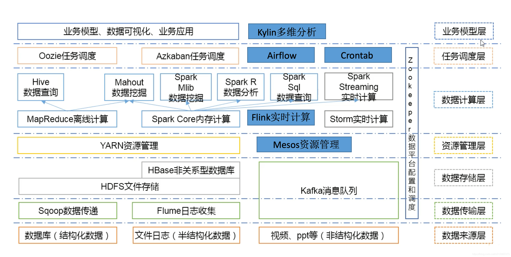

@[TOC]
## 一、概述
前面一篇文章已经很详细的介绍了Hadoop on k8s部署了，这里主要针对部署时可能会调整的地方和注意事项进行讲解，想详细了解详细部署过程可参考我上一篇文章：[Hadoop on k8s 编排部署进阶篇](https://liugp.blog.csdn.net/article/details/131487664)


## 二、快速部署步骤如下
### 1）下载 git
```bash
yum -y install git
```
### 2）部署 mysql
如果小伙伴已经有mysql了，这一步就可以忽略，如果想快速部署mysql可以参考我以下几篇文章：
- [通过 docker-compose 快速部署 MySQL保姆级教程](https://blog.csdn.net/qq_35745940/article/details/130856734)
- [【云原生】MySQL on k8s 环境部署](https://blog.csdn.net/qq_35745940/article/details/126943430)

这里以 docker-compose 部署 mysql 为例：

```bash
# 安装 docker-compose
curl -SL https://github.com/docker/compose/releases/download/v2.16.0/docker-compose-linux-x86_64 -o /usr/local/bin/docker-compose

chmod +x /usr/local/bin/docker-compose
docker-compose --version

# 下载部署包
git clone https://gitee.com/hadoop-bigdata/docker-compose-mysql.git

cd docker-compose-mysql

# 创建网络
docker network create hadoop-network
# 部署
docker-compose -f docker-compose.yaml up -d
# 查看
docker-compose -f docker-compose.yaml ps
# 卸载
docker-compose -f docker-compose.yaml down
```
> 【温馨提示】这里的 mysql 是 `5.7`，如果 mysql 是 `8` 则需要更换 mysql driver  包（即：`mysql-connector-java-*-bin.jar`）。需要重新构建镜像，如不明白的，可以关注我公众号：`大数据与云原生技术分享`，进行咨询~
### 3）创建存储目录（所有节点）

```bash
# 这里默认使用hostPath挂载方式，如果使用pv，pvc挂载方式，就不需要在宿主机上创建目录了，非高可用可不用创建jn。根据自己的情况创建目录。如果目录不同，则需要更改编排。下面会讲解。
mkdir -p /opt/bigdata/servers/hadoop/{nn,jn,dn}/data/data{1..3}
chmod 777 -R /opt/bigdata/servers/hadoop/
```
### 4）下载 hadoop-on-k8s 部署包

```bash
git clone https://gitee.com/hadoop-bigdata/hadoop-on-kubernetes.git

cd hadoop-on-kubernetes

cat values.yaml
```
`nameNode`：

`dataNode`：

### 4）修改 configmap 
如果需要修改database和 nodemanager 的节点数，记得修改 comfigmap 配置：`templates/hadoop-configmap.yaml`


### 5）安装 helm
下载地址：[https://github.com/helm/helm/releases](https://github.com/helm/helm/releases)
```bash
# 下载包
wget https://get.helm.sh/helm-v3.9.4-linux-amd64.tar.gz
# 解压压缩包
tar -xf helm-v3.9.4-linux-amd64.tar.gz
# 制作软连接
ln -s /opt/helm/linux-amd64/helm /usr/local/bin/helm
# 验证
helm version
helm help
```
### 6）开始部署

```bash
# 安装
helm install hadoop ./ -n hadoop --create-namespace

# 更新
# helm upgrade hadoop ./ -n hadoop

# 卸载
# helm uninstall hadoop -n hadoop

# 查看
kubectl get pods,svc -n hadoop -owide
```


> 【温馨提示】上面还有几个pod没起来，那是因为资源不足导致，如果小伙伴资源足够是不会出现这个问题的。

### 7）测试验证
hdfs web：`http://ip:30870`

yarn web：http://ip:

通过 hive 创建库表和添加数据验证集群可用性

```bash
kubectl exec -it hadoop-hadoop-hive-hiveserver2-0 -n hadoop -- bash

beeline -u jdbc:hive2://hadoop-hadoop-hive-hiveserver2:10000  -n hadoop

# 建表
CREATE TABLE mytable (
  id INT,
  name STRING,
  age INT,
  address STRING
)
ROW FORMAT DELIMITED
FIELDS TERMINATED BY ','
LINES TERMINATED BY '\n';

# 添加数据
INSERT INTO mytable VALUES (1, 'Alice', 25, 'F'), (2, 'Bob', 30, 'M'), (3, 'Charlie', 35, 'M');
```

到此 `Hadoop on k8s` 快速部署进阶篇介绍了，有任何疑请关注我公众号：`大数据与云原生技术分享`，进行问题咨询，进行技术交流，如本篇文章对您有所帮助，麻烦帮忙一键三连（点赞、转发、收藏）~

